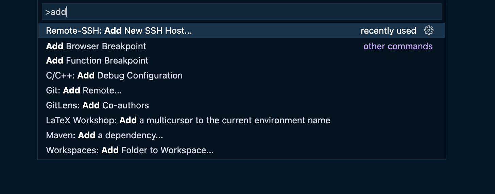
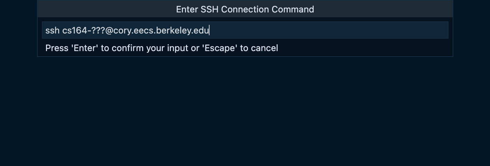
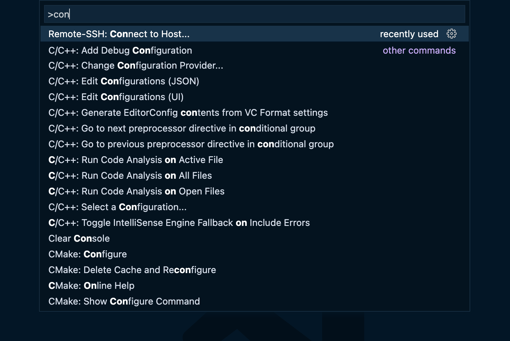
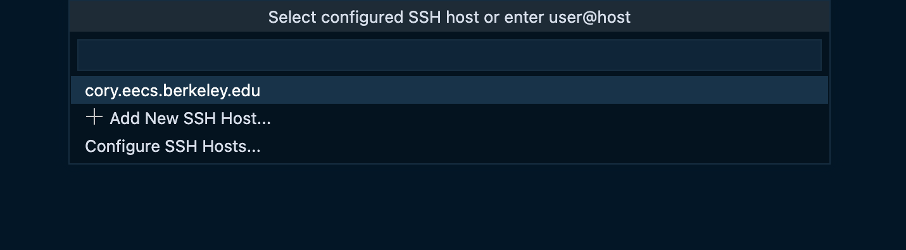
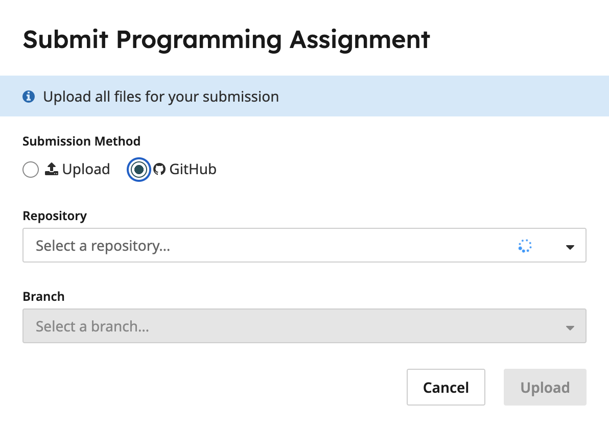
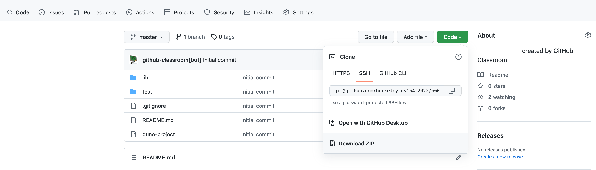
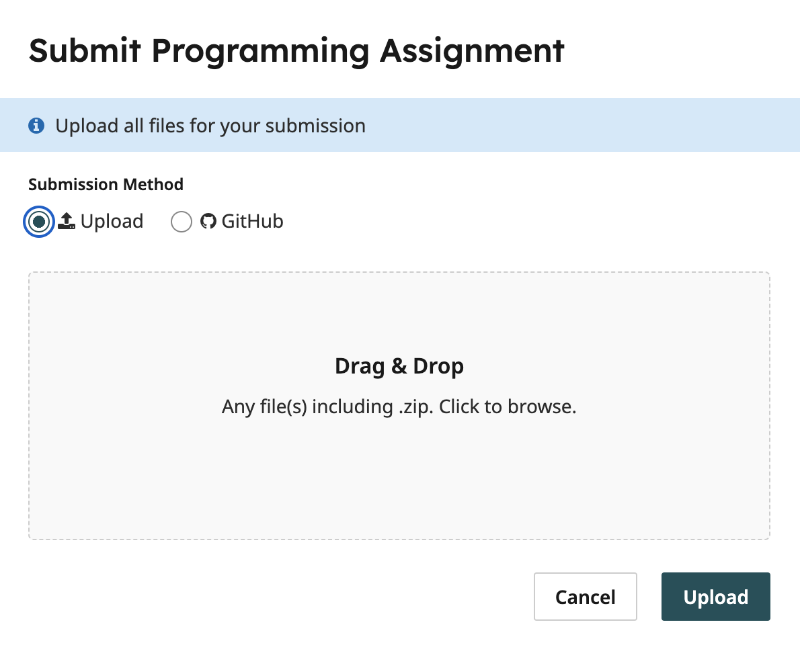

# Software

We'll be using [OCaml](https://ocaml.org/) in CS 164, which requires
only a text editor and a terminal. You're free to use whatever text
editor or IDE you prefer, but **we will only support the recommended
setup below**; we will be unable to provide guidance on any other setups
if they are not working correctly.

*Note for students with limited internet access:* If internet access
will be an ongoing issue during the semester, you can try the (not
officially supported) [local
approach](https://inst.eecs.berkeley.edu/~cs164/fa21/software.html) from
previous years.

## Recommended Setup {#Recommended__Setup}

We will exclusively use the CS 164 instructional machines for this
course. The following steps describe how to connect to the instructional
machines. The instructional machines contain all the OCaml command-line
tools and packages you will need for this course. This is a relatively
new setup for this course, so if you encounter any issues, please let us
know.

*Tip:* If you're *on campus*, you\'ll need to be **connected to
eduroam** to access the instructional machines. If you're *off campus*
(or on any WiFi network that is not eduroam), you'll need to use the
bSecure VPN to access the instructional machines. You can find
instructions for setting up the bSecure VPN
[here](https://security.berkeley.edu/services/bsecure/bsecure-remote-access-vpn).

*Tip:* If you ever get \"Connection refused\" or \"Connection timeout\"
error while trying to connect to the instructional machines, check the
status of the hive servers at
[hivemind.eecs.berkeley.edu](https://hivemind.eecs.berkeley.edu/). All
students have access to the following servers:

-   ashby.cs.berkeley.edu
-   derby.cs.berkeley.edu
-   cedar.cs.berkeley.edu
-   cory.eecs.berkeley.edu
-   gilman.cs.berkeley.edu
-   oxford.cs.berkeley.edu
-   solano.cs.berkeley.edu
-   hive‹n›.cs.berkeley.edu (where n is in the range 1-20, inclusive).

1.  If you have not done so already, please create a [student
    instructional
    account](https://acropolis.cs.berkeley.edu/~account/webacct/) for CS
    164.

2.  You should receive an email with your instructional account username
    and password. Now, try connecting to a hive machine via SSH. Go into
    a terminal and run:

        ssh cs164-???@cory.eecs.berkeley.edu

    (You can use any of the servers listed above). Make sure to replace
    the `???` with your username.

3.  *Optional:* **If you would like to connect to the Hive machines on
    your computer without typing in your password every time**, follow
    these steps. (Credit to the CS61C documentation.)
    1.  Open your terminal. Check if you have existing SSH keys by
        running:

            ls ~/.ssh/id_*

        If you get a \"No such file\" error, generate a key pair by
        running:

            ssh-keygen -t ed25519 -f ~/.ssh/id_ed25519

    2.  Copy your public key to the instructional account with the
        following command:

            ssh-copy-id cs164-???@cory.eecs.berkeley.edu

        If that doesn't work, your computer might not have ssh-copy-id
        installed. Try this instead:
```
cat ~/.ssh/id_ed25519.pub | ssh cs164-???@cory.eecs.berkeley.edu 'cat >> ~/.ssh/authorized_keys'
```
        You might need to type in your instructional account password
        for a final time.

    3.  Try SSHing into the instructional servers now! Run the following
        command in your terminal:

            ssh cs164-???@cory.eecs.berkeley.edu

4.  *Optional:* If typing out `cs164-???@cory.eecs.berkeley.edu` is too
    long, create a host alias with the steps below! Once you create a
    SSH host alias, you will be able to connect to the CS164
    instructional machines with `ssh cs164` or even
    `ssh ILoveCompilers`. (Credit to the CS61C documentation.)
    1.  Follow the steps above to connect to the instructional machines
        without a password.

    2.  Open `~/.ssh/config` in your favorite text editor.

    3.  At the end of the file, add the following lines:

            Host cs164
                HostName cory.eecs.berkeley.edu
            Port 22
                User cs164-???
                IdentityFile ~/.ssh/id_ed25519
                IdentitiesOnly yes
                ServerAliveInterval 60

        Feel free to change the host alias next to \"Host\" from `cs164`
        to `ILoveCompilers` or anything you would like! Make sure that
        you replace the \"User\" from `cs164-???` to your actual
        username.

    4.  You should now be able to SSH into the instructional servers
        with your host alias.

5.  *Optional:* **If you would like to use VS Code for development**,
    you can follow the steps below for remote development. The official
    docs are [here](https://code.visualstudio.com/docs/remote/ssh), but
    we\'ve also abridged them below.
    1.  Install [Visual Studio Code](https://code.visualstudio.com/).
    2.  Install the [Remote --- SSH Extension](https://marketplace.visualstudio.com/items?itemName=ms-vscode-remote.remote-ssh).
    3.  Open Visual Studio Code and press Control-Shift-P (or
        Command-Shift-P on a Mac) to open the Command Palette. Search
        for **Add New SSH Host\...**. 
        
        Type in `ssh cs164-???@cory.eecs.berkeley.edu` and press Enter. You may
        be prompted to enter in your instructional machine password.
        
    4.  Press Control-Shift-P (or Command-Shift-P on a Mac) again to
        open the Command Palette. Select **Remote-SSH: Connect to
        Host\...**. 
        
        the ssh hostname (e.g. `cs164-???@cory.eecs.berkeley.edu`). If
        you\'ve set up a host alias, it might come up as an option as
        well.
        
        1. If you see an error about `powershell`,
           try [this fix from StackOverflow](https://stackoverflow.com/questions/67016426/bash-powershell-command-not-found).
    5.  After a moment, you\'ll be in a new window. Make sure you\'re
        connected by checking the bottom left corner of the window:
        there should be a little green bar with the words \"SSH:
        cory.eecs.berkeley.edu\".
    6.  In the new window, install the [OCaml
        Platform](https://marketplace.visualstudio.com/items?itemName=ocamllabs.ocaml-platform)
        extension. This new window also won\'t have any of the VS Code
        extensions you\'ve already installed locally, so make sure to
        install any extensions you need for writing code.
    7.  You can now open any folder using **File \> Open\...** .

### Connecting to GitHub from the Instructional Machines {#Connecting__to__GitHub}

To pull from and push to your homework repositories on GitHub, you'll
need to set up an SSH key on the instructional machine and add the
public key to your GitHub account. Follow these steps:

1.  While logged into the instructional machine, run the following:

        ssh-keygen -t ed25519 -f ~/.ssh/id_ed25519

    This will generate a public / private key pair on the instructional
    machine.

2.  Copy this public key to your clipboard. You can do this by running:

                  cat ~/.ssh/id_ed25519.pub


    and then copying the output from your terminal.

3.  Add the public key to your GitHub account by going to your [account
    SSH settings](https://github.com/settings/ssh). The title of your
    SSH keypair can be "CS 164 Instructional Machine" (or any other name
    that helps you identify this key).

### Submitting Homework {#Submitting__Homework}

Homework should be submitted on Gradescope. When you have completed your
work on the instructional machine, the simplest way to submit your
homework is to:

1.  Push your final code to your homework repository.
2.  Select the GitHub option in the Gradescope submission interface.

3.  Choose the repository and branch to submit.

If you prefer, you can also submit a ZIP file containing your
submission. To do this:

1.  Download your homework repository as a `.zip` from GitHub.

2.  Submit your `.zip` on Gradescope.


